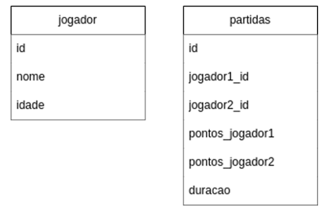

# Q6 - Consulta SQL

## Enunciado

Escreva uma query SQL que retorne, em cada linha, o nome de jogadores que se enfrentaram mais de duas vezes, onde em cada partida:

 

- A soma dos pontos foi maior que 30.
- A duração do jogo foi maior que 90 minutos.
- Não pode haver repetição nos resultados .

## Passo 1: Análise do problema

O objetivo é identificar pares de jogadores que:

- Jogaram entre si mais de duas vezes.

Em todas essas partidas:

- A soma dos pontos dos dois jogadores foi > 30.

- A duração do jogo foi > 90 minutos.

- O resultado final deve listar cada par apenas uma vez, sem duplicatas.

## Passo 2: Implementação

### Junção das Tabelas

```sql
FROM partidas p
INNER JOIN jogador j1 ON p.jogador1_id = j1.id
INNER JOIN jogador j2 ON p.jogador2_id = j2.id
```

- Relacionar cada partida com os dois jogadores participantes.

### Filtragem

```sql
WHERE
    (p.pontos_jogador1 + p.pontos_jogador2) > 30
    AND p.duracao > 90
```

- Selecionar apenas partidas que atendam às condições de pontos e duração.

### Padronização

```sql
SELECT
    CASE WHEN j1.nome < j2.nome THEN j1.nome ELSE j2.nome END AS jogador_a,
    CASE WHEN j1.nome < j2.nome THEN j2.nome ELSE j1.nome END AS jogador_b
```

- Garante que "j1 vs j2" e "j2 vs j1" sejam tratados como o mesmo par.

### Agrupamento

```sql
GROUP BY
    CASE WHEN j1.nome < j2.nome THEN j1.id ELSE j2.id END,
    CASE WHEN j1.nome < j2.nome THEN j2.id ELSE j1.id END
```

- Agrupar por pares de jogadores, independentemente da ordem.

### Filtragem Final

```sql
  HAVING COUNT(*) > 2
```

- Selecionar apenas os pares que se enfrentaram mais de duas vezes.

## 3. Conlusão

Essa abordagem garante que cada par de jogadores seja listado apenas uma vez, sem duplicatas.
